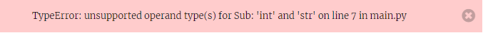
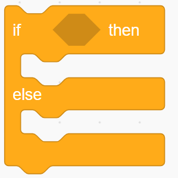

# Age Calculator

In this step we'll write a simple programme to calculate someone's age if you know their year of birth. (OK, I know you don't really need a computer to do this, but it will help to show some important ways that Python carries out certain tasks.)

Have your "first ever Python code" (from step 1) open in a browser window. You will also find it useful to have the [Interactive Python Console](https://trinket.io/console) open in another tab of your browser.

## input()

Before we go on let's introduce another important Python function: ```input()``` which is used to get information from the computer user.

You can try this out in your "first ever Python code" project. Type

``` python
input("What's your name?")
```

and click on Run. In the results panel you will see it has printed **What's your name?** and after that is a flashing black rectangle. That means the code is waiting for you to type in something into the results panel. But before you start to type ***CLICK YOUR MOUSE ONCE INSIDE THE RESULTS PANEL***. This is to shift the *focus* of trinket to the results panel. If you start typing without doing this, trinket will assume you are still editing your code, so whatever you type will appear in the code and will probably cause an error. You can easily remove anything you typed by accident in the code using the keys Cntl-Z, for *undo*.

The phrase inside the brackets in the ```input()``` function is called a *prompt string*.

(Did you notice the *double* quotes around the prompt string above? Python lets you use single *or* double quotes for a text string, but in this case the string includes an apostrophe in the word **What's**. If you tried to use single quotes Python would think the apostrophe was another single quote mark which would indicate the end of the string.)

When you put ```input("What's your name?")``` in your code, and then type in something in the results panel nothing much happens, as the information you typed vanishes. The usual way to save this information is to put it into a *variable*, which you would do with code like this:

``` python
myname = input("What's your name?")
```

Now, whatever you type into the results panel is saved in a variable called ```myname``` and you can print it, or use it in other ways. You could add this line:

``` python
print("Hello", myname)
```

which would print **Hello** followed by what you typed.

## A New Project

We're ready to code our *Age Calculator* programme, so start a new trinket project, following the instructions [here](../trinket_basics/using_trinket.md#starting-a-new-trinket-project). You could call your project "Age Calculator".

Don't forget to add the first line of code in your new project:

``` python
#!/bin/python3
```

If we want to calculate someone's age, we need to know what year they were born and what year it is now.

We could put the year now in a variable called ```this_year```:

``` python
this_year = 
```

where you have to add the correct year after the *equals* sign.

Now we can ask the user what year they were born.

Write code, using the ```input()``` function and a variable to ask the user to type in the year they were born.

<details><summary>Hint</summary>

<p></p>
This is an example of code which will work:

``` python
born = input('What year were you born? ')
```

<p></p>

</details>

Calculating someone's age is a simple subtraction sum. Add this line of code to subtract one variable from another:

``` python
age = this_year - born
```

(If you didn't call your variable ```born``` then use your variable name instead.)

This line calculates the person's age and puts the answer in a variable called ```age```, but our code won't *tell us* the answer unless we *print* it. So add another line

``` python
print('You are', age)
```

Click Run and see what happens. Oh no - there's an error. You can seen that the line which does the subtraction sum is highlighted in red, and at the bottom of the editing panel is a message:



## Types of Python objects

We've run into a problem concerned with the way the ```input()``` function works.

In step 1 we mentioned that numbers and text strings are two different types of Python *object*. It is a feature of the ```input()``` function that whatever you type as your response, *even if it's a number*, the ```input()``` function treats it as a text string. This means that our variable ```born``` (or whatever name you used) will be a *text* type of object, even though the person typed in a number.

You can check this using another Python function called ```type()```, which simply tells you the type of whatever object you put inside the brackets.

Add a line of code just after your ```input()``` line:

``` python
print(type(born))
```

(use your own variable name) and you will see it prints

```<class 'str'>```

which tells you that this variable is of type ```'str'``` which is short for *string*.

### Conversion of an object from one type to another

Luckily there are functions which convert the type of a Python object, so to run our code we need to *convert* our "year born" variable from type ```'str'``` to object type integer. We can do this using the ```int()``` function. Put this line of code after the line with ```type()```:

``` python
born = int(born)
```

This takes the variable born, converts it to integer type and sets the label ```born``` to point to the integer.

Repeat the line with the ```type()``` function after this conversion, and when you run the code you will see

1. that the variable has changed from type ```<class 'str'>``` to ```<class 'int'>``` (short for integer)

2. the code now runs without an error!

In case you wondered, there's another function ```str()``` which converts a number object into a text string. And a function ```float()``` which converts objects into decimal numbers.

## Does the code always give the right answer?

The last number printed at the end of the Results panel is the computer's calculation of the person's age. But *sometimes it gives the wrong answer!* This happens if the person hasn't yet had a birthday this year, which means the computer calculates an age which is one too large.

To make sure the computer always calculates the correct answer we need to check if the person has had a birthday this year or not. Then we will be able to do a different calculation, depending on the answer.

We need to use another ```input()``` function, with another variable, to ask if the person has had a birthday this year. Add this code *just before* the line which calculates the persons age (```age =``` etc). Here is one way to do it, using a variable called ```birthday```:

``` python
birthday = input('Have you had a birthday yet this year (y or n)?')
```

It's always a good idea in a question like this to tell the user what sort of answer you are expecting - so the prompt string here ends with "(y or n)" to tell the user to type "y" or "n", instead of the words "yes" or "no".

So the user has answered "y" or "n" to the question, and this answer has been set to the variable ```birthday```. We can now tell the computer to do one calculation ***if*** the user answered "y", and a different calculation ***if*** the user answered "n", and for this we need to use the Python ```if``` block.

## The Python ```if``` block

You've probably come across coding ```if``` and ```else``` in Scratch. Here is what the Scratch block looks like:



In the hexagon-shaped hole after the word ```if``` you need to put some sort of statement which is either *True* or *False*, then in the white space below you put the code blocks to be run if the statement is True, and in the white space below the word *else* you put the code blocks to be run if the statement is False.

The Python code for ```if ... else``` follows a similar pattern and also uses statements which can be either True or False. Let's first look at  Python statements which are either True or False.

### Python ```True``` or ```False```

Go to a tab in your browser where you have the [Interactive Python Console](https://trinket.io/console) open.

Here is a simple bit of Python code which is clearly True. Type this into the console:

``` python
5 > 3
```

and press Return. The console shows ```True``` which simply tells you that the statement "5 is greater than 3" is true .

If you type in ```5 < 3``` and press Return it will tell you this is ```False```, because 5 is *not* less than 3, so "5 is less than 3" is a false statement.

"Greater than" and "Less than" are examples of comparing one thing with another, called Comparisons, or sometimes Conditionals. Normally we would use these comparisons with variables. Make a variable in the console with

``` python
mynumber = 3
```

then type ```mynumber < 5```. Will this be True or False? (The console will tell you it's True.) You could change the variable to a different number, say 7 (type ```mynumber = 7```), then check ```mynumber < 5``` again, and this time it will tell you this statement is False.

Another comparison we often want to do is to check if two things are equal to one another. But if you type into the console something which seems obviously true

``` python
5 = 5
```

it gives an error. This is because the equals sign has a special meaning in Python to do with setting variables, so it can't be used in a comparison. Instead Python uses a *double* equals sign ```==``` to check if two things are equal.

So if you type ```5 == 5``` the console will now tell you this is ```True```.

You can use the equals comparison with text strings as well as numbers, and that's what we'll do in our Age Calculator code.

### Back to Python ```if``` block

Go back to the Age Calculator code. We've just asked the user to answer "y" or "n" to the question about whether they've had a birthday this year, and this answer has been set to the variable ```birthday```.

The next line of code will begin with the word ```if```. Then we need a statement which can be either True or False - here we could use the statement that the variable ```birthday``` is set to "y", and the line finishes with a **colon** ```:```.

Here is the code for the first line of the ```if``` block:

``` python
if birthday == "y":

```

When you press Return after typing this you will notice that the cursor has jumped a couple of spaces to the right from the beginning of the line - so the next code you type will be ***indented***. Indented lines are incredibly important in Python and act like the white spaces in the Scratch if block to show exactly which bit of code will run for which case.

We know if the person has had a birthday this year and they answered "y", the variable ```birthday``` will be set to "y", so when we make the statement ```birthday == "y"``` this will be ```True```. In this case we can use the calculation we did earlier and it will give the right answer. So in the next line we want to put the code

``` python
  age = this_year - born
```

but notice this line of code is *indented*.

Now we need to consider what to do if the person has *not* had a birthday this year and they answered "n", in which case the variable ```birthday``` will be set to "n", so when we make the statement ```birthday == "y"``` this will be ```False```. The bit of code to run if the statement is ```False``` begins with the word ```else```.

So the next line of code consists of the word ```else``` followed by a colon ```:```, but this line is ***not*** indented:

``` python
else:
```

When you type Return after this line you will see the cursor is indented again. The code for the ```else``` case will do the age calculation but adjusted to give an answer one less than before:

``` python
  age = this_year - born - 1
```

So the complete ```if``` block looks like this:

``` python
if birthday == "y":
  age = this_year - born
else:
  age = this_year - born - 1
```

The final line of the programme is the line which prints the age. This will be the same as before, but this line will *not be indented*, because we want it to run in both cases, whether the answer to the birthday question was "y" or "n".

We now have an age calculator programme which will give the correct answer for everybody.

The indentations show which lines of code should run in the True case and which lines should run in the False case. The blocks of code which are indented are signalled by a colon at the end of the previous line.

Python uses this indentation method to distinguish chunks of code in lots of places, not just in ```if``` blocks, but also in repeat loops and when we write our own functions.

-----

- When you're ready, go on to the [next step](../step3/step3.md) and start learning Python graphics!

- Back to [previous step](../step1/step1.md).

- Back to [front page](../README.md)
