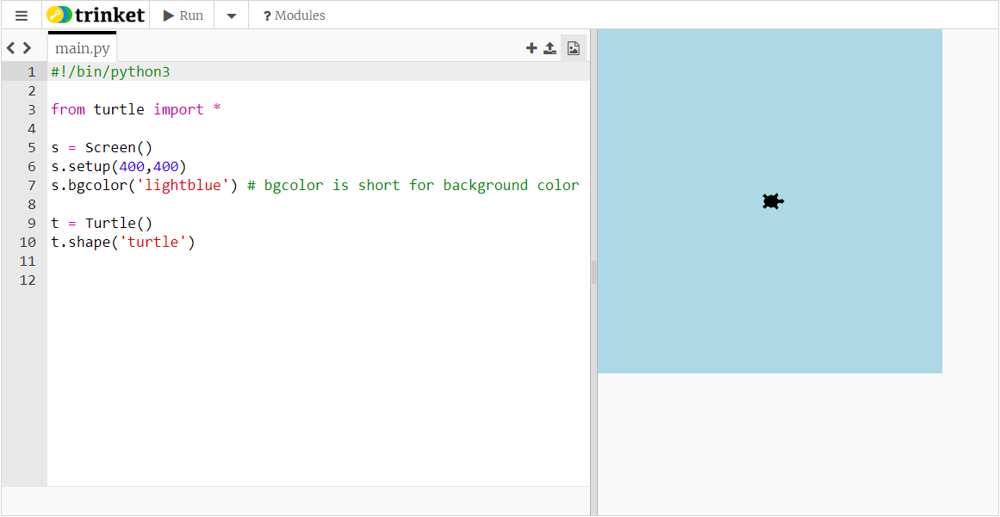
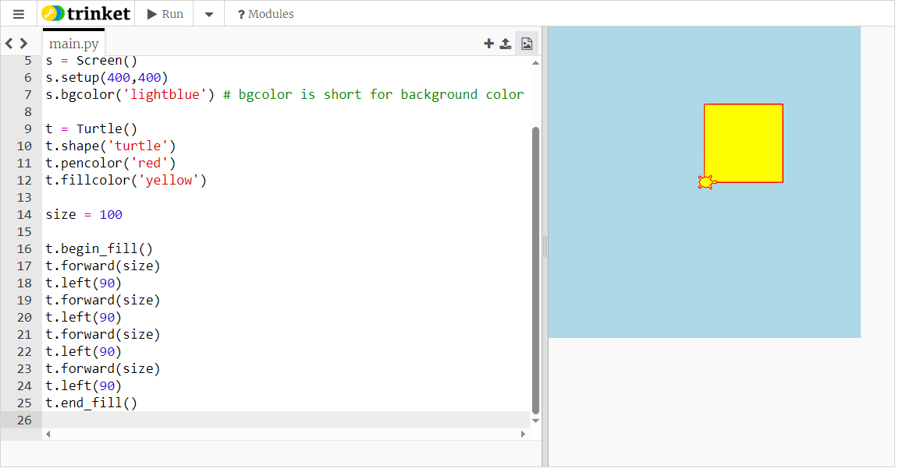

# Python Graphics

Now we can start to get Python drawing things on the screen.

For our first goes at doing graphics we will use a Python library called ```turtle``` which contains a lot of functions specially designed for drawing on the screen. There are sprites, a little bit like Scratch, but they are called ... ***Turtles!!***

Start a new project, following the instructions [here](../trinket_basics/using_trinket.md#starting-a-new-trinket-project) and add this code at the beginning:

``` python
#!/bin/python3

from turtle import *
```

When we used ```import``` before we specified individual functions to import from the libraries (for example: ```from time import sleep```), but here we want to use all the available functions in the turtle library, so the ```*``` sign indicates we want to import *everything*.

## A screen to draw on

The next line of code will create a graphics screen for our drawing. We will use a variable ```s``` with the graphics screen which allows us to apply special screen-functions to our screen using the variable name.

``` python
s = Screen()
```

(Don't forget the brackets after the word Screen, and be sure you use a capital S.) Our project now contains a *new* type of Python object - not a number or a text string, but a *Turtle Screen* object. If you use ```type(s)``` to investigate the type of the variable ```s``` you will find it is of type ```Screen```.

We chose ```s``` as the variable name for our screen, but you can use *any* Python variable name which follows the rules.

We can set the size of our graphics screen in *pixels*. In the code below we specify a size of 400 pixels across, and 400 pixels from top to bottom.

We can also specify the background colour of our screen - here we have used *lightblue*. But notice that the line of code which sets the colour needs to use the American spelling *color*.

``` python
s.setup(400,400)
s.bgcolor('lightblue') # short for background color
```

Click on **Run** and you should see a light blue square shape in the place where you normally see printed results.


If your screen is quite small and you can't see the whole of the square you can actually *drag* the bar between the editing window and the results panel from side to side. Make sure you can see the complete coloured square.

The screen has a ***coordinate system***. This works in a similar way to Scratch coordinates with x = 0, y = 0 as the point in the middle of the screen. In our case the size of the screen is 400 pixels in both directions, which means the minimum x coordinate (at the left edge) is -200, and the maximum x coordinate (at the right edge) is +200. Similarly for y coordinates, the minimum (at the bottom) is -200 and the maximum (at the top) is +200.

## A turtle to do the drawing

Our graphics programming will consist of making sprites, called *turtles*, and moving them around the screen, sometimes drawing lines behind them and sometimes not.

Here is some code to make our first ever turtle:

``` python
t = Turtle()
```

This is exactly the same code as we used to make variables before - for example, ```myname = "Hagrid"``` - the difference is that we are not making a text string for our variable, we are making a *Turtle* object.

We've used a variable name ```t``` for this turtle, but (as with the Screen) you can use *any* valid variable name for a turtle.

Now that we've made a turtle object, and linked it to a variable, we have access to a whole lot of turtle functions to set and control our turtle object.

One thing we can do is set the shape for our turtle object. Here is the code to set it to the shape of a turtle

``` python
t.shape('turtle')
```

If you click Run you will now see your turtle!



Other shapes you can try for your turtle are ```'arrow', 'circle', 'square', 'triangle', 'classic'```. Don't forget: you need to put quotes around these shapes.

You can also change the colour of your turtle. (Again, look out for using the American spelling color.)

``` python
t.color('green')
```

Click Run to see the results. There is a huge range of colours you can use for your turtles (and screens). [This web page](https://trinket.io/docs/colors) has a useful list of all the available colours. Click on a square to see what the colour is called.

## Let's get moving

Now we're going to move our turtle. As you can see, the turtle is pointing to the right (when you make a new turtle it always starts pointing to the right). So if we move it forward, it will move to the right. (If we move it backward it will move to the left.)

Here we will move it forward 100 pixels (which is 1/4 of the width of the screen).

``` python
t.forward(100)
```

Click Run to see the results. Notice the turtle draws a line behind it.

Now we will turn it to the left by 90°.

``` python
t.left(90)
```

Copy these two lines of code, and paste them *three times* onto the end of your code.

When you click run what shape does your turtle draw?

If we wanted to draw a bigger square we could change all the number 100s to a different value. But a better way of doing this is to use a *variable* for the size of the square.

Before you move your turtle insert this line of code:

``` python
square_size = 100
```

Now change all your lines which say ```t.forward(100)``` to say ```t.forward(square_size)```. Now if you want to change the size of your square you only need to make *one* change: in the line where you set the value of the variable.

### More about lines

Sometimes you don't want the turtle to draw a line behind it. The commands to control this are almost exactly the same as Scratch:

```t.penup()``` will stop the turtle drawing a line, and ```t.pendown()``` will start it drawing again.

You can also change the thickness of the line:

```t.pensize(4)``` will draw a very thick line. Try different numbers in the brackets.

### More about colours

Turtles can actually have *two* colours - one for the outline of the shape (which is also the pen colour for drawing lines), and another for the fill colour in the middle.

If you change your code which sets the turtle colour to

``` python
t.pencolor('red')
t.fillcolor('yellow')
```

you will see that the turtle now has a red outline, and a yellow middle. It will draw a *red* line behind it.

You can get the turtle to fill the inside of the square as it draws it. To do this put this line *before* the code which moves the turtle:

``` python
t.begin_fill()
```

and put this line *after* the code which moves the turtle:

``` python
t.end_fill()
```



### Speeing things up

Maybe the turtle moves a little bit too slowly for you. There is a way you can adjust the speed, using the command:

``` python
t.speed(8)
```

You can adjust the number in the brackets - 1 is very slow, 10 is very fast, but, in fact, the fastest speed is when you set the speed to 0.

## First Python "repeat" loop

Unfortunately the code we've written for our turtle is not very good Python coding - there's a lot of repitition in it, and repetition is something coders always try to avoid.

(If you look at the code you will see we have the two lines

``` python
t.forward(square_size)
t.left(90)
```

four times in a row.)

The way to avoid repetition is to put the bits of code that are repeated inside a *repeat loop*. You might already have used one of the Repeat blocks in Scratch which uses the same idea.

In Python there are two types of repeat loop, one begins with the word ```for``` and the other with the word ```while```. We'll do the ```while``` loop here, and cover the ```for``` loop in step 4.

In many ways the ```while``` loop looks a lot like a Python ```if``` block, which we looked at in [step 2](../step2/step2.md#the-python-if-block). At the start of the set of lines which we want to repeat we have a line which starts with the word ```while```, followed by a statement which is either true or false, followed by a colon ```:```. Then, *all* the lines which we want to repeat in this loop are *indented*.

Here's how it works: Python looks at the ```while``` line, and checks if the statement is true or false. If it's true then Python runs the repeat block (the lines of code which are indented), then checks the ```while``` line again to see if the statement is still true. If it is then Python runs the repeat block *again*, and it keeps repeating this block of code as long as the statement is true; however if it finds the statement has changed to become false, then Python ignores the lines in the repeat block, and goes on to the rest of the code.

There's one further thing we need to make a ```while``` repeat loop - we need a variable, which we use to count how many times we run the loop.

Add this line of code after the ```begin_fil()``` line:

``` python
counter = 0
```

This is the variable we'll use to keep count and we've set it to have the value 0. (You can use a different variable name if you want.)

Then as the next line add:

``` python
while counter < 4:
```

Here, our true-or-false statement is ```counter < 4```
and since we just set counter to 0 this statement will obviously be true.

Now, take the next two lines of code and *indent* them - you can do this by placing the cursor at the beginning of the line and pressing the TAB key once. These are the lines which will be repeated.

The next six lines you should *delete*. So your segment of code should look like this:

``` python
t.begin_fill()
counter = 0
while counter < 4:
  t.forward(square_size)
  t.left(90)
t.end_fill()
```

Run the code and see what happens.

It looks as if our turtle is going to go round for ever  - in fact it will. We have accidentally created a Python *forever* loop, because we have used ```while``` with a statement which is *always true*. You can make a Python forever loop this way using any statement which is always true: eg ```5 < 7```; ```'black' != 'white'``` but the normal way is to use the word ```True```. So a Python forever loop would normally begin:

``` python
while True:
```

But we don't want a Python forever loop, we want one which will run four times, then stop. The way to do this is to add an extra line inside the loop which increases the counter by 1, each time we run the loop.

One way to increase the value of a variable by one is to use this code:

``` python
counter = counter + 1
```

If this was a maths sum it would look like complete nonsense, but in Python the equals sign isn't used to indicate two things are equal, it's used to set the value of a variable.

In this code Python starts at the right hand side, looks at the value of variable *counter* and adds one to it; then the equals sign has the effect of taking this new increased number and setting (updating, really) the counter variable equal to it.

Actually, increasing the value of a variable by 1 is something we need to do *so often* that we have a little shortcut for it. So the quick way to increase variable *counter* by 1 is to use the code:

``` python
counter += 1
```

Add this line as the last line *inside* the ```while``` loop (underneath ```t.left(90)```) - which means it has to be indented, and now run the code again. You should find the turtle goes once round the square and stops.

It's worth thinking through how the loop is operating, step by step: we set counter to 0, then go to the while loop - Python looks at ```counter < 4```
and decides this is true, so runs the loop. Inside the loop we increase counter by 1, so it's now set to 1. Python goes back to the while line, looks at ```counter < 4``` and decides this is still true, so runs the loop again. Inside the loop we increase counter by 1, so it's now set to 2 etc etc. Once we've run the loop four times we finally set counter to 4. Python goes back to the ```while``` line, looks at ```counter < 4``` but now decides this is not true (because counter equals 4, so it's no longer less than 4), so the loop stops, and Python goes on to the rest of the code.

## A shape of many sides

Squares are nice, but could we change our code to get our turtle to draw a five-sided figure?

One obvious change is to make our loop repeat 5 times instead of 4. What would you change to make this happen?

<details><summary>Click here if you don't know</summary>

``` python
while counter < 5:
```
  
</details><br>

But if you run your code you will see there's something else you also need to change: it's the angle the turtle turns at the end of each side. Can you work out what the angle needs to be?

<details><summary>Hint</summary>
<br>
This is quite a tricky problem - so think about it this way. The turtle starts its shape facing to the right, and at the end of the shape it's facing to the right again. This means it's made a complete 360°
turn while it draws the shape.
<p></p>
We see in the case of the square it made this 360°
turn in four equal steps, so each step was a quarter of 360°, which is 90°. For our five-sided figure we need to make this turn in five equal steps. You could easily work out the required angle with a calculator, but that would be a waste of effort. Why? Because Python is really good at doing calculations, so we can easily get Python to work out the angle. Like this:
<p></p>


``` python
  t.left(360 / 5)
```
  
</details><br>


-----

- When you're ready, go on to the [next step](../step4/step4.md) and find out about Python lists, while writing a *Hogwarts Sorting Hat* programme.

- Back to [previous step](../step3/step3.md).

- Back to [front page](../README.md)
