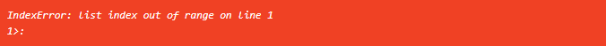
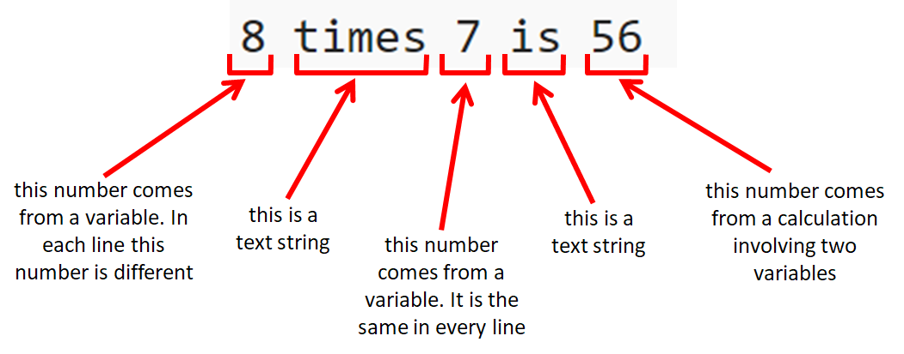

# Lists and ```for``` loops

Start a new project, following the instructions [here](../trinket_basics/using_trinket.md#starting-a-new-trinket-project) and add this code at the beginning:

``` python
#!/bin/python3
```

This project will be for a Hogwarts School Sorting Hat, so you can give it a name to show that.

You will also find it useful to have the [Interactive Python Console](https://trinket.io/console) open in another tab of your browser.

## Sorting Hat

When new students arrive at Hogwarts School of Witchcraft and Wizardry they are divided into the school's different *houses*. They put on the *sorting hat*, which analyses their character and strengths and weaknesses and decides which house will suit them best.

We can't hope to do any of that with Python, so our Sorting Hat programme is a bit of a cheat, and just picks a house at random.

We'll start by writing a rather long and clumsy piece of code, and then show how we can make it much shorter by using a type of Python object called a *list*.

If we're going to pick a house at random then we will need to import from the ```random``` library the function ```randint```, which generates a random integer. Look back at your previous projects and see if you can find one which uses this function. Copy the line of code which contains the word ```import``` and paste it in at the beginning of the new project.

<details><summary>If you're <i>really</i> not sure how to do this...</summary>
<br>
Copying code from another project (your own or someone else's) is a very good way of getting familiar with Python, so you will be helping yourself if you get used to doing this.
<p></p>
Here is the line of code you need:
<p></p>

``` python
from random import randint
```
  
</details>

Since there are four houses in Hogwarts School we will generate a random integer between 1 and 4 and use this to select a house. Put the random integer in a variable. You can pick any name for the variable but it would be useful to have a name that indicates this is a random number. (WARNING: *don't* use the name ```randint``` as this is the name of a function, and you should avoid giving variables the same names as functions.) Look back at previous code if you aren't sure how to do this. (You will find a clue in [step 1](../step1/step1.md#python-libraries) in the section on Python libraries.)

Now we will make a rather complicated ```if ... else``` block to select the house. In the code below you need to put the name of your random number variable in place of the four asterisks:

``` python
if **** == 1:
  house = 'Hufflepuff'
elif **** == 2:
  house = 'Slytherin'
elif **** == 3:
  house = 'Gryffindor'
else:
  house = 'Ravenclaw'

print(house)
```

If you Run the code several times, it will print one of the four Hogwarts houses at random.

The words ```if``` and ```else``` we have already used in the *Age Calculator* code, but we haven't come across ```elif``` before.

```elif``` is short for 'else if' and it's a way of testing more than one statement inside a Python ```if``` block. If you work through this code you will see that it is testing for all the possible values of the random number. If it's a 1 (the line beginning ```if```) then we will select the house 'Hufflepuff', but if it's not a 1 it could still be 2, 3 or 4. The next line, beginning with ```elif```, now tests to see if it's a 2, in which case the house will be 'Slytherin'. But the random number could still be 3 or 4, so we need to do yet another test. First we test if it's a 3, with another ```elif``` line, which will make the house 'Gryffindor'. Finally, if the random number is not 1, 2 or 3, then it *must* be 4, so we don't need to test it - we just say ```else```, which means all the other tests have failed, in which case the house is 'Ravenclaw'.

A key feature of these multiple test ```if``` blocks is that as soon as Python finds one of the tests which is ```True``` it carries out the code for that test and skips the rest of the tests. In some circumstances this can save a lot of time.

In a Python ```if``` block the first line has to start with ```if```. If you have an ```else:``` line it has to go at the end (but you don't have to have one). In between, you can put as many ```elif``` blocks as you need.

We have made an example project to show a slightly more complicated multiple test ```if``` block, where the order of the tests is critical. You can find it [here](if_else_example.md).

## Lists in Python

Well that's the rather clumsy version of the Sorting House code. But we can make it much simpler using a Python *list*. Move the the browser tab with the [Interactive Python Console](https://trinket.io/console).

We are going to create a list, so type this into the console

``` python
houses = ['Hufflepuff', 'Slytherin', 'Gryffindor', 'Ravenclaw']
```

The first part of this code is simply making a variable, called ```houses```. To the right of the equals sign we have left and right *square brackets* ```[ ]``` and in between these we have a list of the different houses, each one separated by a comma. The square brackets indicate that we are making a *list*, so the variable ```houses``` will be of type "list".

Because each of the items in the list is surrounded by quote marks we can see that this is a list of *text strings*. But you can also have lists of integer numbers, decimal numbers, turtles, in fact, just about any type of Python object. You can even have lists of lists!

We can print a list using the ```print()``` function:

``` python
print(houses)
```

which will print out all the items including the square brackets.

### Identifying the items in a list

Often we want to carry out some operation on just one item in a list, so we need a way to identify each of the items. The items in a list are each given an identifier, or ***index*** number, but be careful! You might think the first item in the list would have an index number 1 but it doesn't - the first item has the index number 0, and the index numbers increase from there.

In our ```houses``` list, the item 'Gryffindor' would have the index number 2, so if we wanted to print this we would type:

``` python
print(houses[2])
```

As you see we can refer to any item by using the variable name, followed by the index number in square brackets.

Try typing

``` python
print(houses[4])
```



As you can see this produces an error - an "Index" error. This is a very common error, and almost all coders will accidentally create one of these at some time - it simply means you have tried to use a list with an index number which doesn't exist. Why did we cause this error? It's because although our list has four items the index numbers start at 0, so the last item in the list has index number 3, not 4. There is *no* item with an index number 4, so we get an error.

### Things you can do with lists

Now we've made a list we have opened the possibility of using a whole lot of special *list* functions in Python.

We can add an item to the list. Let's say Hogwarts is getting full and needs another house. We can add a house called 'Wokies' to the list like this:

``` python
houses.append('Wokies')
```

In the console if you just type ```houses``` it will print the list for you (without having to use the ```print()``` function). You will see the extra item.

We can also remove an item from the list. Type:

``` python
houses.remove('Slytherin')
```

Type ```houses``` again and you will now see that 'Slytherin' is no longer in the list.

----

### Using the arrow keys in the console

The UP and DOWN arrows are really useful when you are using the console, as they allow you to reuse previous commands without having to retype them. If you hit the UP arrow once it will get back the last command you used; if you hit UP again it will find the command you used before that, and so on. Once you've found the command you want you press Return to execute it.

----

Sometimes we want to find out which item in the list has a given index number - for example: ```houses[1]``` will tell us which item has the index 1. At other times we want to know the opposite: we know an item is in the list but we don't know what position it's in. For this we have another function called ```index()```. So if we know the item ```'Gryffindor'``` is in the list ```houses``` we can find out what its index number is with

``` python
houses.index('Gryffindor')
```

If you want to check this, type ```houses``` in the console, or hit the UP arrow a couple of times, then hit Return to show the whole list.

Another list function will sort our list. If we type

``` python
houses.sort()
```

then display the list again (hit the UP arrow a couple of times to get the command ```houses``` then press Return) you will see the list has now been sorted into alphabetical order.

Sometimes we make an empty list in Python, then add items to it in the code. This code will make an empty list attached to the variable ```newlist```:

``` python
newlist = []
```

If we need Python to count how many items there are in the list we can use a function ```len()```, short for length. Try this with the ```houses``` list:

``` python
len(houses)
```

and it will probably print 4, if that's the number of items in that list.

### A much simpler Sorting Hat programme

To make the really simple Sorting Hat programme we first need to import another function from the ```random``` library, so we will make a change to the ```import``` line at the beginning of the code. If you want to import more than one named function from a library you don't need a separate line for each function, you can just make a list of the functions you want, with a comma between each. So change this line to read:

``` python
from random import randint, choice
```

so we can use the ```choice``` function. This function acts with a list and simply selects an item at random from the list.

So we no longer need a random number for our code; and we no longer need any of the ```if``` block. The whole code looks like this:

``` python
#!/bin/python3

from random import randint, choice

houses = ['Hufflepuff', 'Slytherin', 'Gryffindor', 'Ravenclaw']

house = choice(houses)
print(house)
```

In fact we can make the code even shorter by combining the last two lines, by putting the ```choice()``` function *inside* the print function:

``` python
print(choice(houses))
```

Using a list has made the code much shorter.

## The Python ```for``` loop

As we've seen, lists can be very useful for simplifying code, but one of the most common uses for a list is in the type of repeat loop which begins with the word ```for```.

It's similar to a ```while``` loop: you have a first line which ends in a colon, then all the lines which you want to repeat are indented.

The first line of a ```for``` loop has *five* parts:

1. the word ```for```
2. the name of a *variable* to be used in the loop
3. the word ```in```
4. a list, or a variable name pointing to a list
5. a colon ```:```

To demonstrate this we will go to the end of the Sorting Hat programme. Type this code at the end:

``` python
for h in ['Gryffindor', 'Hufflepuff', 'Ravenclaw', 'Slytherin']:
  print(h)

print('Finished')
```

Run the code to see what happens.

Here we have a loop variable ```h``` (this can have *any* name as long as it's within the rules). Python starts the loop by setting the loop variable to the *first* item in the list. It then carries out the indented lines of code - here we only have one line, which is to print the variable ```h```. So Python prints 'Gryffindor'.

Python then goes back to the top of the loop and sets variable ```h``` to the *second* item in the list, and carries out the indented lines - so this time it prints 'Hufflepuff'. In fact Python keeps going back to the top of the loop until it runs out of items in the list. When that happens it ends the loop and goes on to the rest of the code - in the example here it will now print 'Finished'.

That's how a ```for``` loop works.

Sometimes we simply want code to repeat a set number of times. So if we want a bit of code to repeat 10 times we just set up a ```for``` loop with *any* list which has 10 items in it. Lists can have numbers as well as text strings, so one ```for``` loop which repeats 10 times might begin:

``` python
for n in [1, 2, 3, 4, 5, 6, 7, 8, 9, 10]:
```

Here we have used ```n``` as the loop variable, but, again, any variable with a valid name could be used.

For a 'repeat 10 times' loop this is not too much typing, but what if you wanted a 'repeat 100 times' or 'repeat 1000 times' loop? Would you have to type out a list with 1000 items in it?

## The very useful ```range()``` function

Luckily Python gives us a function called ```range()``` which automatically generates lists of integer numbers. We can explore the very useful ```range()``` function in the [Interactive Python Console](https://trinket.io/console).

In the console type ```range(6)``` and press Return. Now try it again with a different number inside the brackets. After two or three goes you will get to understand that the range function generates a list of whole numbers, and you will be able to predict what numbers your list will contain.

<details><summary>Hint</summary>

<p></p>

```range()``` with one number in the brackets produces a list of numbers starting with 0 and increasing by 1 until <i>one less than</i> the number in the brackets.

</details>

You can see that whatever number you put in the brackets that is the number of items you have in your list. So if you want a Python repeat 10 times loop you can start it with the code:

``` python
for n in range(10):
```

The function ```range(10)``` generates a list with 10 numbers in it, so the loop will repeat 10 times.

### ```range()``` with two numbers in the brackets

But ```range()``` can do more than that.

In the Interactive Python Console type ```range()``` but this time put two numbers inside the brackets. If this produces an empty list ```[]``` try swapping the order of the two numbers. See if you can work out what the two numbers do.

<details><summary>Hint</summary>
<br>
The first number sets the starting value and the second number is <i>one more than</i> the last number you want.
<p></p>
If you type this:
<p></p>

``` python
range(5,10)
```

it will give you a list which starts at 5 and goes up to 9.

</details>

### ```range()``` with three numbers in the brackets

But ```range()``` is even more useful still. 

Try typing this into the console:

```
range(1,20)
```

Now add a comma after the number 20 and add a third number (this should be a small number). Press Enter and see what list the function produces. Change the third number, and see if you can work out what it does!

<details><summary>Hint</summary>
<br>
The first number sets the starting value and the second number is <i>one more than</i> the last number you want, and the <i>third</i> number sets the size of the steps between numbers.
<p></p>
If you type this:
<p></p>

``` python
range(5,20,3)
```

it will give you a list which starts at 5 and goes up in jumps of 3, until the last number which is less than 20. In this case that is 17.

</details>

## A times table revision project

Is there a times table which you find slightly difficult to remember? Some people find the 7-times table a bit tricky. So we'll write a short programme to print out a times-table so we can use it for revision. Here's the sort of print out we want to get:

``` python
1 times 7 is 7
2 times 7 is 14
3 times 7 is 21
4 times 7 is 28
5 times 7 is 35
6 times 7 is 42
7 times 7 is 49
8 times 7 is 56
9 times 7 is 63
10 times 7 is 70
11 times 7 is 77
12 times 7 is 784
```

Using a ```for``` loop we can create this output with just a couple of lines of code.

Start a new project, following the instructions [here](../trinket_basics/using_trinket.md#starting-a-new-trinket-project) and add this code at the beginning:

``` python
#!/bin/python3
```

Give it a name to show that it's a times table programme.

We want to use it for *any* times table, not just the 7-times table, so lets have a variable where we set the times table we want to print. We'll set it to 7 to start with but we can change this to get any other times table.

``` python
table = 7
```

Now we want a ```for``` loop. Look back in this page to [here](#the-python-for-loop) to see the five parts you need in the first line. Let's use ```n``` as the loop variable. Your list should include these numbers

``` python
[1,2,3,4,5,6,7,8,9,10,11,12]
```

but rather than type this list see if you can use ```range()``` to make this list. Try it out in the console with different numbers in the brackets until you get it right.

In some ```for``` loops we only use the loop variable for counting how many times we run the loop, but in this example we actually need to use the loop variable ```n``` in making the output.

We can generate the output using the ```print()``` function with several items inside the brackets, each separated by a comma. This print function will have to be *indented*. It is placed after the ```for``` line, and it will run once for every number in the list. Each time we run the loop the loop variable ```n``` will be set to the next number in the list.

Here is a picture of just one line of the output for the seven times table. This means we have set the variable ```table = 7```:



The picture shows there are *five* different parts to the output, so the ```print()``` function will contain *five* items in the brackets, each separated by a comma.

Can you work out what each of the five items inside the brackets of the ```print()``` function will be to print out the times table?

Your whole code will look like this, except you have to work out what goes in place of the question marks!

``` python
#!/bin/python3

table = 7

for n in range(????):
  print(????, ????, ????, ????, ????)
```

Yes - that's all the code you need. You will find all the answers you need in different parts of this *Hello Python* course. Look at [this step](#the-very-useful-range-function) for the ```range()``` function and [here](#the-python-for-loop) for the explanation of the ```for``` loop, and look at [step 1](../step1/step1.md#print) for using the ```print()``` function.

If your first attempt doesn't quite work then see if you can make some changes to get it right. You can't harm the computer by doing this, so try anything!

<details><summary>Here is one way to do it, but <i>PLEASE</i>  try to work it out for yourself first. You will learn much more about Python coding by trying it yourself than by looking at this answer!</summary>

``` python
#!/bin/python3

table = 7

for n in range(1,13):
  print(n, 'times', table, 'is', n * table)
```

</details>

## Next Steps

That's the end of our short introduction to Python. I hope you enjoyed it.

Here are some ideas for other projects you can try.

----

- Back to [previous step](../step3/step3.md).

- Back to [front page](../README.md)
