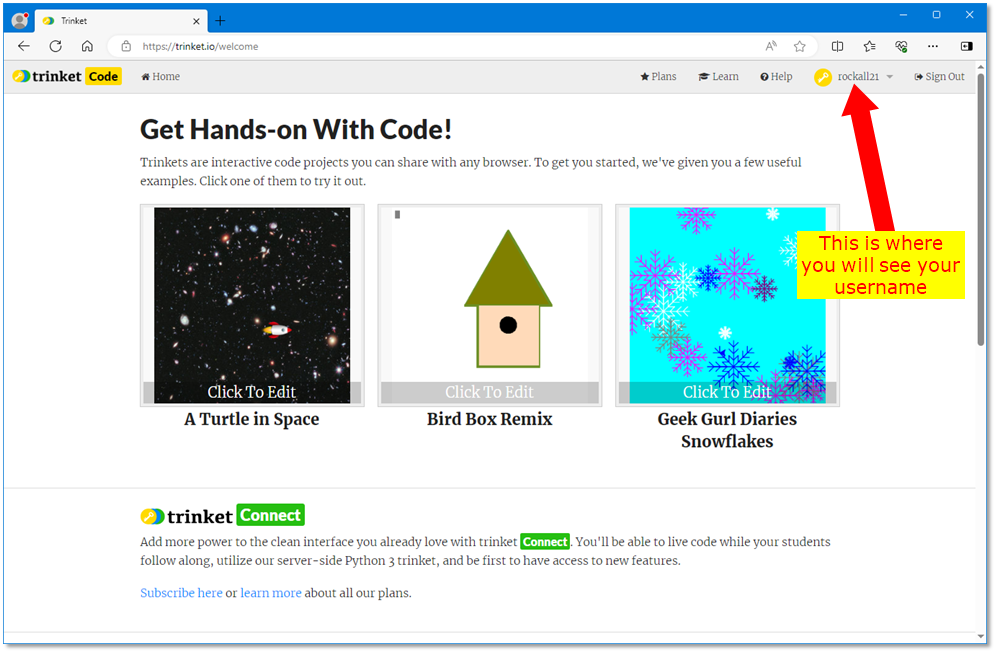
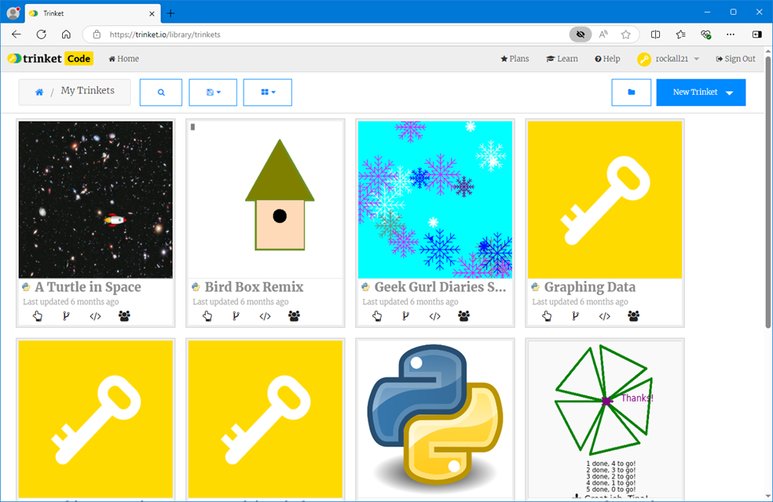
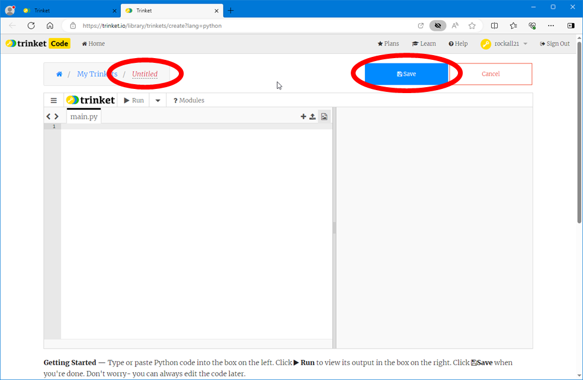

# Using the trinket online editor

We have found that the *Google Chrome* and *Microsoft Edge* browsers work well with trinket. Unfortunately, *Mozilla Firefox* doesn't seem to work so well, so we would advise you to avoid this browser.

## Logging in

Go the the trinket home page at [trinket.io](https:\\trinket.io),  click on **Log In**, and enter your username and password. This will take you to your home page:

With every new account there are some trinket projects already in your account - these are the square pictures you can see.

## Looking at all your trinket projects

Click on the little downward-pointing arrow next to your username, and select *My Trinkets*:

This page shows all the projects that are in your account. To open one, just click on it.

## Starting a new trinket project

To start a new trinket project click on the little downward-pointing arrow next to your username and select *New Project*. A drop-down list opens up and you want to select the ***TOP*** item *Python*, but instead of left-clicking you should **right-click** and select *Open in a new tab* which will put your new project in a new tab, so you can quickly go back and look at the list of all your trinkets.

In the new tab you will find your new project:

First, give your project a name by typing the name where you see the word *Untitled*, then click on the *Save* button. You are now ready to begin adding Python code into your project.

