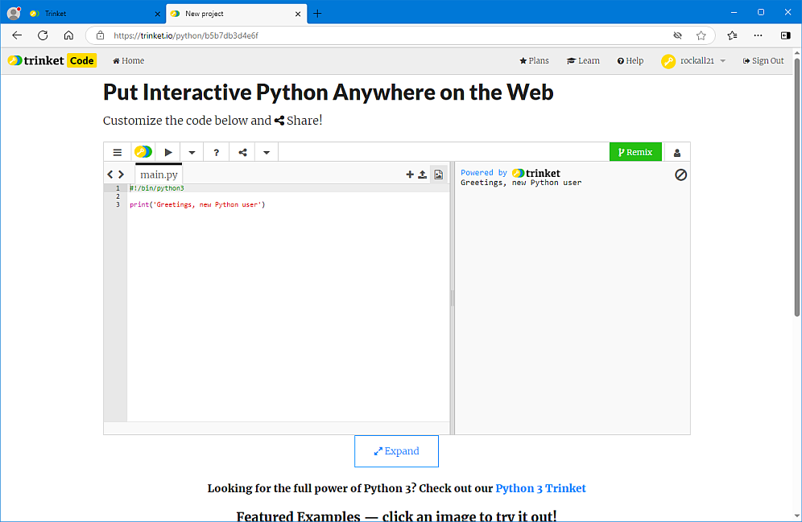
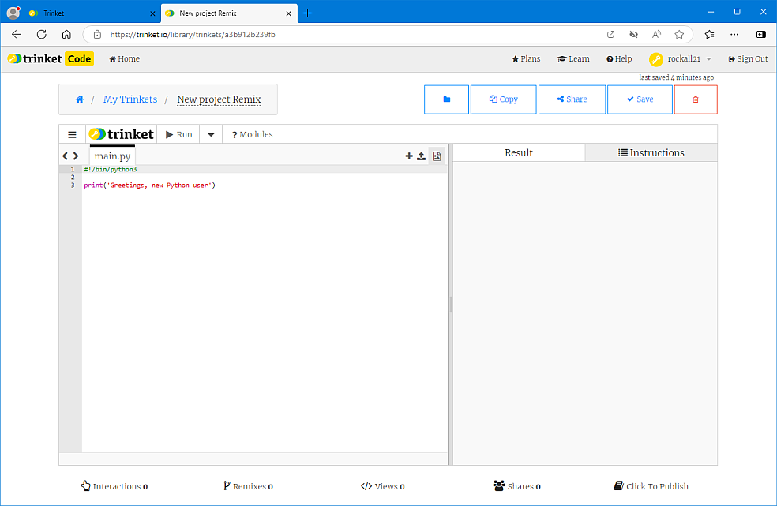

# Using the trinket online editor

We have found that the *Google Chrome* and *Microsoft Edge* browsers work well with trinket. Unfortunately, *Mozilla Firefox* doesn't seem to work so well, so we would advise you to avoid this browser.

## Logging in

Go to the trinket home page at [trinket.io](https://trinket.io),  click on **Log In**, and enter your username and password. This will take you to your home page:


With every new account there are some trinket projects already in your account - these are the square pictures you can see.

## Looking at *all* your trinket projects

Click on the little downward-pointing arrow next to your username, and select *My Trinkets*:


This page shows all the projects that are in your account. To open one, just click on it.

## Starting a new trinket project

To start a new trinket project click on the little downward-pointing arrow next to your username and select *New Project*. A drop-down list opens up and you want to select the ***TOP*** item *Python*, but instead of left-clicking you should **right-click** and select *Open in a new tab* which will put your new project in a new tab, so you can quickly go back and look at the list of all your trinkets.

In the new tab you will find your new project:


First, give your project a name by typing the name where you see the word *Untitled*, then click on the *Save* button. You are now ready to begin adding Python code into your project.

### Python gobbledegook...

The trinket editor offers a mixture of old Python version 2 commands and new Python 3 commands. To avoid confusion we need to tell trinket to *always* use Python 3 commands, so all your trinket Python projects should have this code as the first line:

``` python
#!/bin/python3
```

## Remixing someone else's project

Trinket projects are all public, and anyone can open and look at them. If you want to edit someone else's project you can *Remix* it to your account. All you need is the full internet address (URL) of the project. Here is a URL link to a trinket project. If you click on this link it will open the project in your browser:

[https://trinket.io/python/b5b7db3d4e6f](https://trinket.io/python/b5b7db3d4e6f)



You will notice a green button labelled *Remix* in the top left. Click on this, and it will change to say *remixed*. Although the project is now remixed into your account you can't save your changes in this window. Instead, open *My Trinkets* (see [above](#looking-at-all-your-trinket-projects) for how to do this) then look for the project in your trinkets. It will probably be at the top left of the list. Click on this and it will open the full editor window:



You can now ***rename*** the project by clicking on the project name. You also have a *Save* button. Make sure you save your projects often so that you don't lose any of your code.

[Back to front page](../README.md#using-the-trinket-editor)
